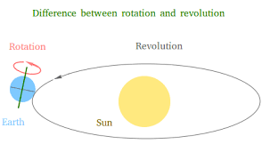

ကမ္ဘာက ဝန်ရိုးပေါ် လည်တဲ့အခါ.. နေ ကို စမှတ်ဆုံးမှတ်ထားပြီး တစ်ရက်တာ 24 နာရီကို ဖြေရှင်းထားတယ်.. တကယ်တော့ ရွေ့လျားမှုတွေကြောင့် ဆုံးမှတ် နေ နှင့်ပြန်ဆုံသည့် အခါ စက်ဝိုင်း ၏ 360 မဟုတ်ပဲ 361 ဖြစ်နေသည်။နာရီလက်တံက 24 နာရီအတွက် 360 နှစ်ပါတ်လည်ခဲ့တာဖြစ်သည် 



ဒါကြောင့်ကြယ်တွေကို စမှတ်ဆုံးမှတ်ထားသည့် လည်ပါတ်မှုတစ်ခုသတ်မှတ်ထားတယ်.. ဘယ်ကြယ်တွေလည်းဆိုတဲ့မေးခွန်းအတွက် အဖြေတွေရှိပါတယ်.. ကမ္ဘာလည်တာ 360 ပြည့်တဲ့နေရာကကြယ်ပဲ.. ကျနော်နေရာကနေတွက်ရင် ကျနော့်ရဲ့ ကြယ်ပေါ့ 😁😁 တာဝန်ရှိတဲ့ အဖွဲ့အစည်းတွေက နေရာ အလိုက် fixed လုပ်ထားတဲ့ကြယ်တွေရှိပါတယ်.နေကို စမှတ်ဆုံးမှတ်ထားတဲ့ 24 နာရီ ကို solar day လို့ခေါ်ပြီး 360 ကို သတ်မှတ်ထားတဲ့ 23 နာရီ 56 မိနစ်ကို sidereal day လို့ခေါ်တယ်.. လည်လည်းလည်တယ်.. နေကိုလည်းပါတ်တယ်.. လည်ပါတ်တာပေါ့... နေကိုတစ်ပါတ်ပါတ်မိတဲ့ အချိန်မှာ solar day 365.25 ရှိပီး sidereal day 365.2422 ရှိသည်။ 

ဒီနေရာမျာ ပညာရှင်တွေစဥ်းစားတဲ့ပုံကို ကျနော့်အမြင်က.တစ်နှစ်တိုင်းပိုနေတဲ့ solar day 0.25 ကိုလေးနှစ်တစ်ခါ အရင်ရှင်းပြစ်တယ်.. solar နှင့် sidereal day ကွာဟချက်ကို 0.01 လို့ သတ်မှတ်ပီး 0.0022 ကိုခဏ ဘေးဖယ်ထားခဲ့တယ်.. တစ်နှစ်မှာ 0.01 ဖြစ်တဲ့အတွက် နှစ် 100 မှ တစ်ရက်စာရမယ်.. 

ဒီတော့ နှစ်တစ်နှစ်ကို 4 နှင့် စားလို့ ပြတ်ရင် Leap Year..သို့သော် ရာပြည့်နှစ်တွေသည် ရက်ထပ်နှစ်မဖြစ်ပါ..solar နှင့် sidereal ကွာခြားချက် ကို 0.01 လို့သတ်မှတ် ထားတဲ့အတွက် နှစ်တစ်ရာ ပြည့်တိုင်း တစ်ရက်စာအပိုဖြစ်သွားတဲ့အတွက် 4 နှင့်စားလို့ပြတ်သော်လည်း 100 နှင့်ပါစားလို့ပြတ်ခဲ့တဲ့ နှစ် မှာ ရက်ထပ်နှစ်မဖြစ်ခဲ့ပါဘူး.. ကျနော်တို့နှင့် အနီးစပ်ဆုံး 1800 1900 နှစ်တွေ ရက်ထပ်နှစ် မဖြစ်ခဲ့ဘူး.1800 ပြည့်နှစ်ပြက္ကဒိန်တစ်ခု online မှာတွေ့ဖူးပါတယ် ..ဖေဖော်ဝါရီလကို 28 ရက်ပဲပြထားပါတယ်.. 

နောက်ထပ်တစ်ခုက အပေါ်မှာ တစ်နှစ်စာ solar နှင့် sidereal ကွာခြားချက် အမှန်..  - 0.0122 ကို နှစ်တစ်ရာ အတွက် တစ်နှစ်ကို 0.01 ကိုယူသုံးခဲ့ပြီးဖြစ်လို့ ရှင်းနိုင်တယ်.. သို့သော် 0.0022 ကို နှစ်လေးရာ ပြည့်တဲ့အခါမှ အနီးစပ်ဆုံးဖြစ်အောင် 0.0025 လို့ယူဆပြီး တစ်ရက်စာပြန်ပေါင်းပါတယ် 

ရာပြည့်နှစ်တွေက ရက်ထပ်နှစ် မဟုတ်ဖူးဆိုပေမည့် 400 နှင့်စားလို့ ပြတ်ရင် ရပ်ထပ်နှစ် ဖြစ်ပါတယ်...ကျနော်တို့သက်တမ်း မှာ အမှတ်တရ ကြုံခဲ ဖူးပါတယ်.. Year 2000 .. Y2K ပါ.. နယ်ပယ်ပေါင်းစုံက ပြင်ဆင်ကျော်ဖြတ်ခဲ့ရတဲ့ နှစ်ပါ.. 2038 ခုနှစ် Jan 19 မှာတော့ ကွန်ပြူတာမပရိုဂရမ်များနှင့်ပါတ်သက်တဲ့ အချိန်ရေတွက်မှုပြသနာတစ်ခု ရှိတယ်လို့သိရပါတယ််.သိပ်တော့နားမလည်သေးပါ..ဒီ လည်တာ ရယ် ပါတ်နေတာရယ်ကြောင့် နယ်ပယ်ပေါင်းစုံက အကျိုးသက်ရောက်မှုကအများကြီးပါ.. 

ရက်ထပ်နှစ်ကို စစ်တဲ့ Javascript function ဖြစ်သည်

```js
/**
 * Determines if a given year is a leap year.
 *
 * @param {number} year - The year to check.
 * @returns {boolean} - True if the year is a leap year, false otherwise.
 */

const isLeapYear = (year) => {
  if (year % 4 !== 0) {
    return false;
  } else if (year % 100 !== 0) {
    return true;
  } else if (year % 400 !== 0) {
    return false;
  } else {
    return true;
  }
};
```


